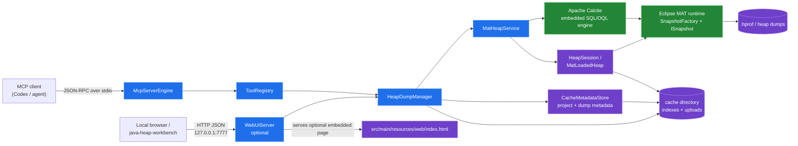
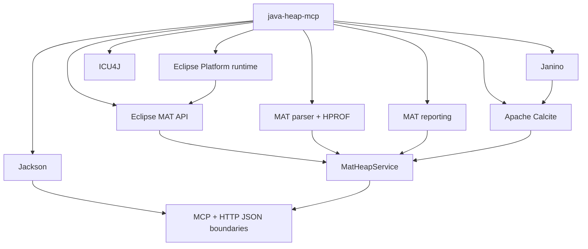

# `java-heap-mcp` open-source dependencies

`java-heap-mcp` is a Java 25+ Maven service. Dependency versions are managed in the repository parent [`pom.xml`](../../pom.xml). Eclipse MAT bundles are downloaded and unpacked into Maven's `target/mat/` directory during the build; no MAT JARs are stored in source control.

## Runtime architecture

The MCP client uses the stdio path; the workbench uses the optional HTTP path. Both routes converge on the same project, cache, and heap-analysis services.

## Dependency relationships

| Dependency | Why it is used | Value to the project |
| --- | --- | --- |
| [Eclipse Memory Analyzer (MAT) API](https://www.eclipse.org/mat/) — `org.eclipse.mat.api` | Provides the snapshot model and heap-analysis APIs. | Enables overviews, histograms, dominators, object inspection, GC-root paths, and leak-suspect analysis. |
| Eclipse MAT parser and HPROF support — `org.eclipse.mat.parser`, `org.eclipse.mat.hprof` | Reads heap-dump files and builds or reuses MAT indexes. | Makes `.hprof` dumps available as queryable `ISnapshot` instances. |
| Eclipse MAT reporting — `org.eclipse.mat.report` | Supplies MAT report and query infrastructure. | Supports MAT-native analysis and leak-hunter operations in headless mode. |
| Eclipse Platform — `org.eclipse.core.runtime`, `org.eclipse.core.resources`, `org.eclipse.core.commands` | Provides the runtime/plugin services expected by MAT’s OSGi bundles. | Allows MAT to run inside this standalone server rather than only inside the MAT desktop application. |
| [Apache Calcite](https://calcite.apache.org/) — `calcite-core` | Provides the embedded SQL planner and execution engine used for the Calcite-backed OQL dialect. | Adds read-only SQL capabilities such as filtering, joins, grouping, ordering, pagination, heap tables, and MAT-aware functions. |
| [Janino](https://janino-compiler.github.io/janino/) — `janino`, `commons-compiler` | Compiles expressions used by Calcite at runtime. | Makes dynamic query expressions executable without adding a separate compiler process. |
| [Jackson](https://github.com/FasterXML/jackson) — `jackson-databind`, `jackson-datatype-jsr310` | Serializes MCP messages, HTTP payloads, configuration data, and result records. | Provides the JSON boundary for MCP clients and the optional web API, including Java time values. |
| [Google Guava](https://github.com/google/guava) — `guava` | Supplies general-purpose collection and utility APIs used by the Calcite/MAT integration. | Reduces supporting code and provides well-tested collection utilities. |
| [ICU4J](https://icu.unicode.org/) — `icu4j` | Supplies Unicode and internationalization support required by the Eclipse/MAT runtime. | Keeps the embedded MAT runtime compatible with its platform dependencies. |
| [MCP Java SDK](https://github.com/modelcontextprotocol/java-sdk) — `mcp-core`, `mcp-json-jackson2` | Provides the MCP server model, stdio transport, protocol negotiation, tool registration, and schema validation. | Replaces the hand-rolled JSON-RPC transport with the official MCP implementation while preserving the project’s Jackson 2 stack. |

## Test dependencies

| Dependency | Why it is used | Value to the project |
| --- | --- | --- |
| [JUnit 5](https://junit.org/junit5/) — `junit-jupiter` | Defines and runs the Java unit tests. | Verifies MCP protocol handling, heap lifecycle behavior, caching, and OQL validation. |
| [AssertJ](https://assertj.github.io/doc/) — `assertj-core` | Provides fluent assertions in tests. | Keeps test expectations readable, especially for structured heap and JSON results. |

The server’s own Java packages provide the application layer around these projects: `McpServerEngine` handles MCP JSON-RPC, `WebUiServer` exposes the optional HTTP API, `HeapDumpManager` owns project/handle/cache lifecycle, and `MatHeapService` coordinates MAT and Calcite analysis.
