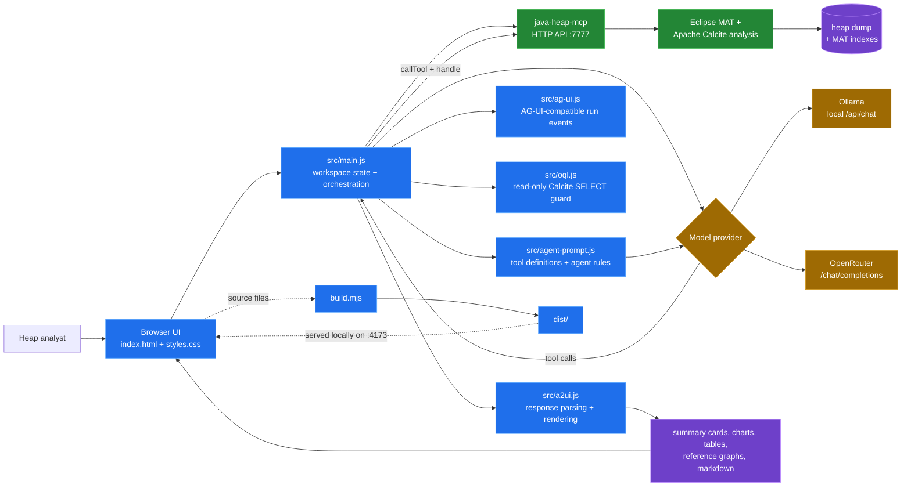
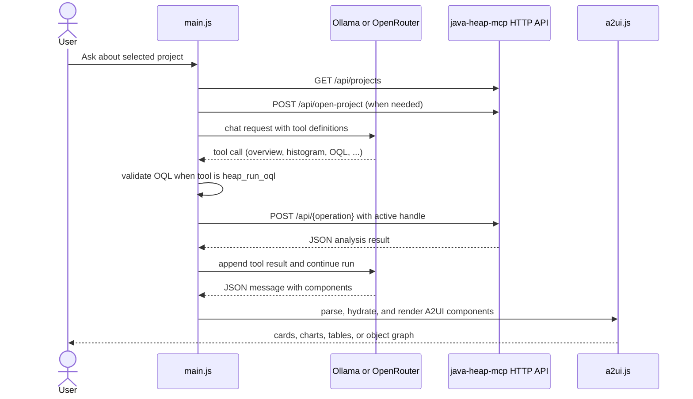

# `java-heap-workbench` open-source dependencies

`java-heap-workbench` is a static browser application. Its [`package.json`](../package.json) has no runtime or development package dependencies, so there is no npm dependency tree to maintain.

## Browser and service boundaries

## Analysis run flow

## Project dependencies and integrations

| Dependency or platform API | Why it is used | Value to the project |
| --- | --- | --- |
| [Node.js](https://nodejs.org/) built-in `fs/promises`, `http`, `path`, and `url` modules | Runs [`build.mjs`](../build.mjs), copies source files into `dist/`, and serves the app during local development. | Keeps the build and development server small, dependency-free, and easy to run. |
| Browser Fetch API | Calls the `java-heap-mcp` HTTP endpoints and the configured model endpoint. | Provides the network layer for project selection, heap analysis, and agent requests without a frontend framework. |
| Browser Web Storage API (`localStorage`) | Stores provider, model, endpoint, and connection settings. | Preserves local workbench configuration between browser sessions. |
| Browser DOM, SVG, Canvas, and `crypto.randomUUID()` APIs | Builds the interface, renders charts/reference graphs, and identifies AG-UI-compatible runs. | Provides the UI, visual analysis output, and event tracking without a UI framework or chart library. |
| [`java-heap-mcp`](../../java-heap-mcp/) HTTP API | Supplies project handles, heap loading state, overviews, histograms, dominators, OQL, object inspection, GC-root paths, and leak suspects. | Keeps heap parsing and analysis in the Java service while the workbench remains a lightweight client. |
| [Ollama](https://ollama.com/) integration | Optionally sends chat/tool requests to a locally hosted model through `/api/chat`. | Supports private, local agent-assisted heap investigations. |
| [OpenRouter](https://openrouter.ai/) integration | Optionally sends OpenAI-compatible chat/tool requests to `/chat/completions`. | Allows the same workbench flow to use hosted models selected by the user. |

## Internal modules

The workbench’s reusable behavior is implemented in its own small ES modules rather than imported packages:

| Module | Why it is used | Value to the project |
| --- | --- | --- |
| [`src/main.js`](../src/main.js) | Coordinates UI state, model calls, MCP calls, and analysis runs. | Connects the user workflow end to end. |
| [`src/oql.js`](../src/oql.js) | Performs a lightweight read-only Calcite `SELECT` validation before requests leave the browser. | Prevents common invalid or mutating query requests. |
| [`src/ag-ui.js`](../src/ag-ui.js) | Emits AG-UI-compatible run lifecycle and tool events. | Gives the UI a transport-neutral progress/event model. |
| [`src/a2ui.js`](../src/a2ui.js) | Parses model responses and renders summaries, charts, tables, and graphs. | Turns tool results into visual reports without a component framework. |

Ollama and OpenRouter are service integrations rather than npm dependencies; the workbench only uses their HTTP APIs. MAT, Calcite, and the Java dependency set belong to `java-heap-mcp`, not to the browser bundle.
